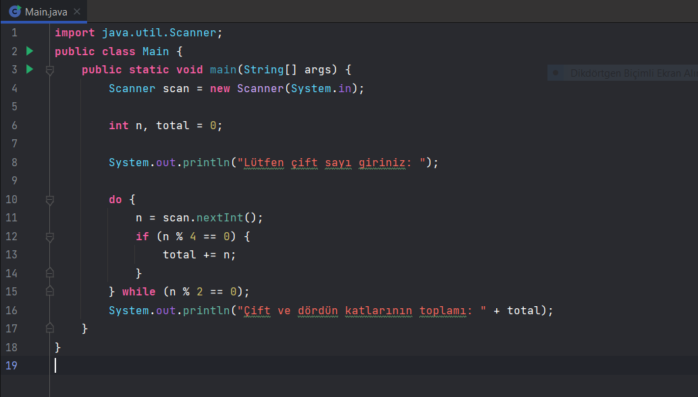
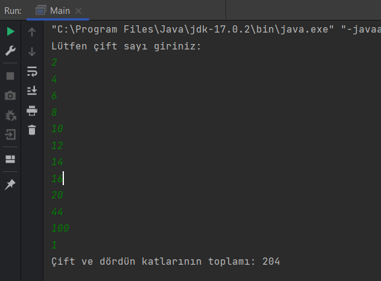

# MERHABA PROGRAMIMA HOŞ GELDİNİZ!

* [**Patika Profil Linkim**](https://app.patika.dev/guleerbilal)

* Bu programım kullanıcı girilen çift sayılardan dördün katları olan sayıları topluyor ve yazdırıyor. Eğer kullanıcı
tek sayı girerse programdan çıkış yapılıyor ve toplam görünüyor.

## *Kodlarım*

*

*